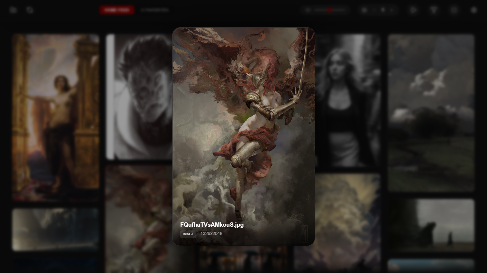
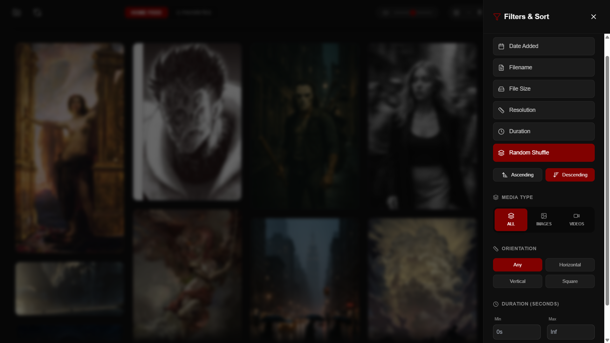
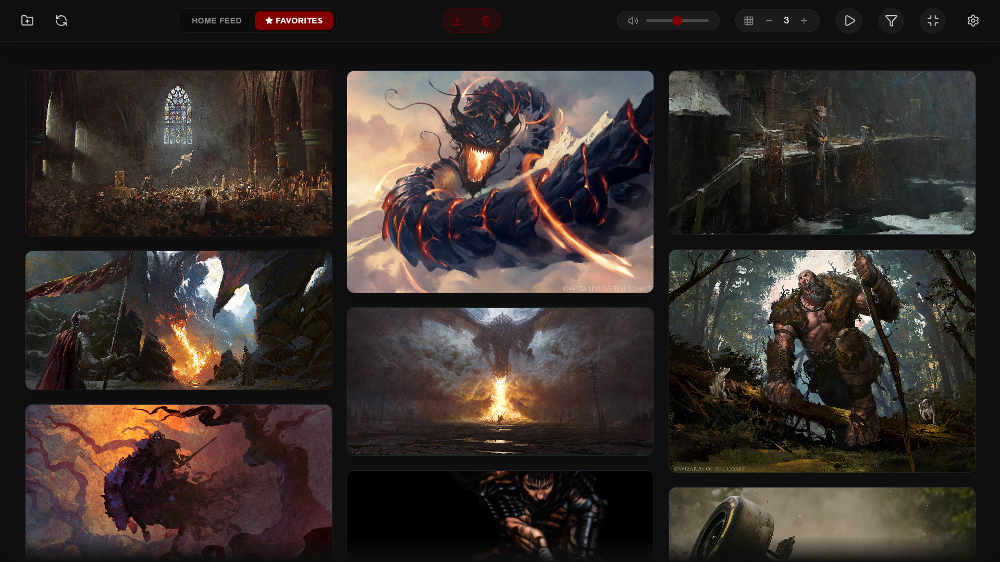
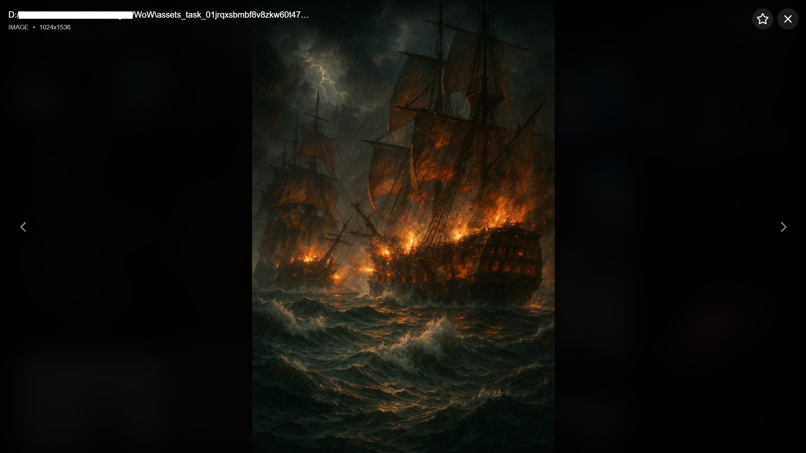

# Xcroller ✨

**Xcroller** is a high-performance, aesthetically pleasing media gallery and feed viewer built for the desktop. It's designed to handle massive libraries of images and videos with a focus on speed, immersion, and ease of discovery.

  

## 🚀 Features

- **💫 Infinite Fluid Grid**: A fast, responsive masonry grid that handles thousands of items with ease.
- **⭐ Favorites System**: Star your favorite media and access them instantly in a dedicated feed.
- **🔄 Smart Autoscroll**: Sit back and browse. Scroll speed is fully adjustable, and it intelligently pauses on hover.
- **🔍 Powerful Filtering**: Filter by media type (Image/Video), orientation, resolution, or duration.
- **📂 Folder-Based Feeds**: Create custom feeds from specify folders or your entire library.
- **⚡ Hotkey Driven**: Everything is accessible via keyboard for a power-user experience.
- **📦 Easy Export**: Export all your favorited media to a new folder with one click.

## 📸 Screenshots

| High-Speed Browsing | Precision Filtering |
| :---: | :---: |
|  |  |
| *Hover previews with instant audio* | *Granular control over your view* |

| Favorites Management | Immersive Viewer |
| :---: | :---: |
|  |  |
| *Your curated collection* | *Deep-dive with zoom and pan* |

## 🛠️ Installation

Xcroller is currently in beta. You can download the latest installer from the [Releases](https://github.com/Jens/Xcroller/releases) page.

1. Download `Xcroller_x64_en-US.msi` (or the `.exe` bundle).
2. Run the installer.
3. Add your media folders and start scrawling!

## 💻 Tech Stack

- **Frontend**: [React](https://reactjs.org/) + [Vite](https://vitejs.dev/) + [Zustand](https://docs.pmnd.rs/zustand/)
- **Backend**: [Rust](https://www.rust-lang.org/) + [Tauri](https://tauri.app/)
- **Database**: [SQLite](https://sqlite.org/) (High-speed local indexing)
- **Styling**: Vanilla CSS with a focus on glassmorphism and modern UI.

---

Built with ❤️ for media enthusiasts.
